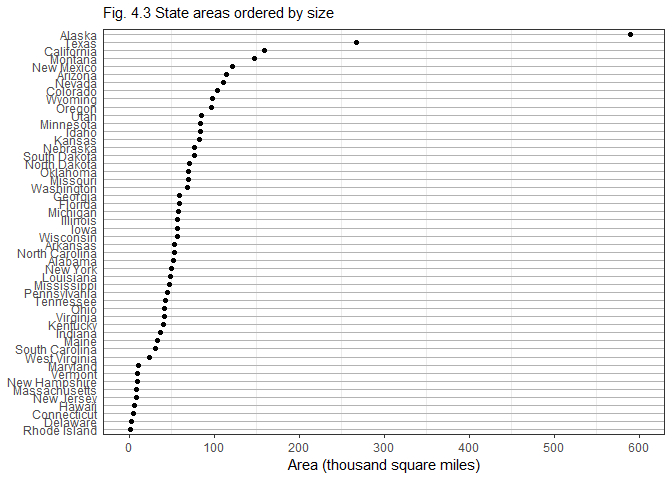
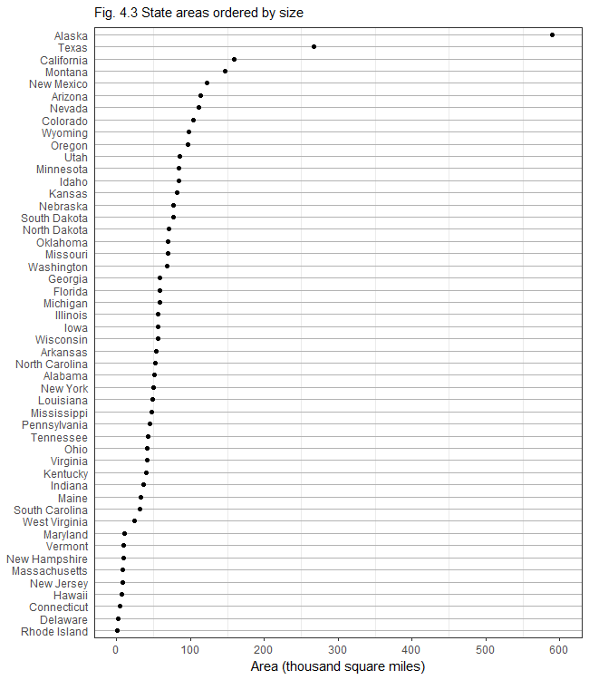

# dot plot

The *dot plot* by Bill Cleveland is a preferred substitute for data
typically shown in pie charts or bar charts. If you would like to read
more about the rationale behind dot plots, see (Robbins, 2013).

The data structure for which dot plots are suited are:

  - Observations include one categorical variable and one quantitative
    variable.  
  - The same where the categories are *conditioned* by additional
    categories.
  - In any case, there is just one numerical quantity displayed, usually
    along the horizontal \(x\) axis.

## data

Create `dot_plot.Rmd` in your `practice_work/` directory. Write the code
chunks in the tutorial with as much of the prose as you like to explain
the work.

``` r
library(tidyverse)
```

The standard R installation includes US “state” data sets, with all data
arranged according to alphabetical order of the state names. (Learn more
by typing `?state` in your Console.) There are 7 data sets, named:

    state.abb 
    state.area 
    state.center 
    state.division 
    state.name 
    state.region 
    state.x77 

Let’s take a look at several variables, one numerical (area) and three
that are categorical (abbreviation, name, and region):

``` r
# examine the vector of abbreviations
glimpse(state.abb)
##  chr [1:50] "AL" "AK" "AZ" "AR" "CA" "CO" "CT" "DE" "FL" "GA" "HI" ...

# examine the vector of names  
glimpse(state.name)
##  chr [1:50] "Alabama" "Alaska" "Arizona" "Arkansas" "California" ...

# examine the vector of areas  
glimpse(state.area)
##  num [1:50] 51609 589757 113909 53104 158693 ...

# examine the vector of regions 
glimpse(state.region)
##  Factor w/ 4 levels "Northeast","South",..: 2 4 4 2 4 4 1 2 2 2 ...
```

Of the categorical variables, two are encoded as characters
(abbreviation and state) and one is encoded as a factor (region).

Let’s collect these 4 vectors in a new data frame, renaming the
variables to eliminate the “dot” in the variable names and writing the
data to file for later use.

``` r
# create a new data frame
state_df <- data_frame(abbr = state.abb, 
        name   = state.name, 
        area   = state.area, 
        region = state.region)
```

Examine the result

``` r
glimpse(state_df)
## Observations: 50
## Variables: 4
## $ abbr   <chr> "AL", "AK", "AZ", "AR", "CA", "CO", "CT", "DE", "FL", "...
## $ name   <chr> "Alabama", "Alaska", "Arizona", "Arkansas", "California...
## $ area   <dbl> 51609, 589757, 113909, 53104, 158693, 104247, 5009, 205...
## $ region <fct> South, West, West, South, West, West, Northeast, South,...
```

``` r
# write the df to file for later use 
write_csv(state_df, "data/cm5017_state.csv")
```

Recall the data structure. Note that the factor variable (region) has
been changed to a character variable.

``` r
# recall the contents
glimpse(state_df)
## Observations: 50
## Variables: 4
## $ abbr   <chr> "AL", "AK", "AZ", "AR", "CA", "CO", "CT", "DE", "FL", "...
## $ name   <chr> "Alabama", "Alaska", "Arizona", "Arkansas", "California...
## $ area   <dbl> 51609, 589757, 113909, 53104, 158693, 104247, 5009, 205...
## $ region <fct> South, West, West, South, West, West, Northeast, South,...
```

Examine the area data more closely.

``` r
summary(state_df$area)
##    Min. 1st Qu.  Median    Mean 3rd Qu.    Max. 
##    1214   37317   56222   72368   83234  589757
```

With area values in the hundreds of thousands of square miles, the graph
scale is easier to read if we display in thousands of square miles.

``` r
# create a new column with area in 1000s of sq mi
state_df <- state_df %>%
    mutate(scaled_area = area / 1000)
```

I’m going to assign region as an ordered factor (for graph
conditioning), arranged by descending order of the median area in each
region. In a column of conditioned ggplot2 graphs, the top panel is
determined by the factor level-1, the second panel is level-2, etc.

``` r
# region as an ordered factor 
state_df$region <- factor(state_df$region, 
    levels = c("West", "North Central", "South", "Northeast"),
    ordered = TRUE)

# check the result
typeof(state_df$region)
## [1] "integer"

# ordered levels
levels(state_df$region)
## [1] "West"          "North Central" "South"         "Northeast"
```

The West region has a collection of states with the largest median area;
the Northeast has the smallest median state area.

## graph

The basic dot plot is obtained using the `geom_point()` function.
Structurally, this is an x-y scatterplot with the quantitative variable
on the x-axis and the qualitative variable on the y-axis.

``` r
fig <- ggplot(state_df, aes(x = scaled_area, y = name)) +
  geom_point()

fig
```

<!-- -->

To easily make visual comparisons, we’d like the rows of the dot plot
ordered in descending values of the areas. The `reorder(name,
scaled_area)` argument can be read, “Reorder the rows (names of the
states) from top to bottom in order of descending scaled area (the x
variable).”

Edit the previous
code.

``` r
fig <- ggplot(state_df, aes(x = scaled_area, y = reorder(name, scaled_area))) +
  geom_point()

fig
```

<!-- -->

Next, I’ll add some formatting layers to

  - Set the x-scale limits and tick mark locations
  - Set the x label and omit the y label
  - Assign a title
  - Use the black and white theme
  - Omit the x-grid
  - Include the y-grid as gray lines
  - Adjust the title font size and location
  - Omit the y tick marks

<!-- end list -->

``` r
fig <- fig +  
  scale_x_continuous(breaks = seq(0, 600, 100), limits = c(0, 600)) +
  labs(x = "Area (thousand square miles)", y = NULL) +
  ggtitle("Fig. 4.3 State areas ordered by size") +
  theme_bw() + 
  theme(panel.grid.major.x = element_blank(),
    panel.grid.major.y = element_line(colour = "grey70"), 
    plot.title   = element_text(size = rel(1), vjust = 1.5),
    axis.ticks.y = element_blank()
    )

fig
```

<!-- -->

The graph is a bit compressed vertically, so I’ll print to file to
control the resolution and dimensions, then read the PNG file back in to
the document. I usually do a bit of sizing trial and error before I get
an output I like.

``` r
# print to file
ggsave("results/cm05017_dot-plot.png", plot = fig, 
    width = 6.5, height = 7.5, units = "in", dpi = 100)
```

``` r
# read the PNG file back in to the document

```

<!-- -->

<!-- ## conditioning  -->

<!-- *Conditioning* converts a single dot plot into multiple panels, where each panel is a plot with the same scales, but the data belong to a particular subset of the data.  -->

<!-- The subsets are determined by the levels of the factor used for conditioning.  -->

<!-- In this example, the conditioning variable is `region`, with 4 levels. Thus the conditioned plot has four subpanels, one each for "West", "North Central", "South", and  "Northeast".  -->

<!-- Conditioning in ggplot2 is accomplished using `facet_grid()`.  -->

<!-- ```{r} -->

<!-- fig <- fig +  -->

<!--    facet_grid(region ~ .)  -->

<!-- fig -->

<!-- ``` -->

<!-- Ouch, that's ugly.  -->

<!-- A typical data set will have an entry for every intersection of the two categorical variables, but here a state name can only belong to one region.  -->

<!-- To eliminate the names that don't exist in a region, we use the `scales = "free_y"` argument.    -->

<!-- Add to the existing code.  -->

<!-- ```{r} -->

<!-- fig <- fig +  -->

<!--    facet_grid(region ~ ., scales = "free_y") -->

<!-- fig -->

<!-- ``` -->

<!-- The default is for the panels to have the same vertical height. But the number of states in a region is not constant, hence the panels all have different numbers of rows.  -->

<!-- To allow the panel heights to self-adjust for equal row spacing, we add the `space = "free"` argument.  -->

<!-- Add to the existing code and write to file.   -->

<!-- ```{r} -->

<!-- fig <- fig +  -->

<!--    facet_grid(region ~ ., scales = "free_y", space = "free") +  -->

<!--      ggtitle("Fig. 4.3 State areas ordered by region and size")  -->

<!-- ggsave("results/cm05017_dot-plot-conditioned.png", plot = fig,  -->

<!--     width = 6.5, height = 7.5, units = "in", dpi = 100) -->

<!-- # read the PNG file back in to the document -->

<!-- knitr::include_graphics("../results/cm05017_dot-plot-conditioned.png") -->

<!-- ``` -->

<!-- Pretty neat!  -->

## references

<!-- Figure 4.3 is from Robbins and the `ggplot2` code is adapted from Zhao & Bryan.   -->

<!-- 1. Naomi Robbins (2013) [*Creating More Effective Graphs*](http://www.nbr-graphs.com/resources/recommended-books/), Chart House.      -->

<!-- 2. Joanna Zhao and Jenny Bryan,  [r-graph-catalog](https://github.com/jennybc/r-graph-catalog), providing ggplot2 scripts for nearly all of the graphs in Robbins' book.     -->

<!-- 3. Winston Chang, [Facets (ggplot2)](http://www.cookbook-r.com/Graphs/Facets_(ggplot2)), [Cookbook for R](http://www.cookbook-r.com/).   -->

<div id="refs" class="references">

<div id="ref-robbins2013">

Robbins, N. (2013). *Creating More Effective Graphs*. Chart Haouse.

</div>

</div>
